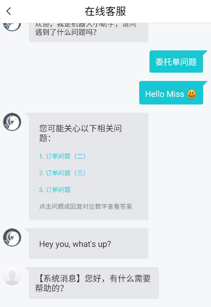

# meiqia-react-native

[](https://github.com/996icu/996.ICU/blob/master/LICENSE)

## Getting started

`$ npm install meiqia-react-native --save`

or

`$ yarn add meiqia-react-native`

### Mostly automatic installation

`$ react-native link meiqia-react-native`

### Manual installation

#### iOS

1. In XCode, in the project navigator, right click `Libraries` ➜ `Add Files to [your project's name]`
2. Go to `node_modules` ➜ `meiqia-react-native` and add `RNMeiqia.xcodeproj`
3. In XCode, in the project navigator, select your project. Add `libRNMeiqia.a` to your project's `Build Phases` ➜ `Link Binary With Libraries`
4. Run your project (`Cmd+R`)<

#### Android

1. Open up `android/app/src/main/java/[...]/MainActivity.java`
  - Add `import com.reactlibrary.RNMeiqiaPackage;` to the imports at the top of the file
  - Add `new RNMeiqiaPackage()` to the list returned by the `getPackages()` method
2. Append the following lines to `android/settings.gradle`:
  	```
  	include ':meiqia-react-native'
  	project(':meiqia-react-native').projectDir = new File(rootProject.projectDir, '../node_modules/meiqia-react-native/android')
  	```
3. Insert the following lines inside the dependencies block in `android/app/build.gradle`:
  	```
      compile project(':meiqia-react-native')
  	```

## Usage

#### import
```javascript
import Meiqia from 'meiqia-react-native';
```

#### init appKey
```javascript
Meiqia.init({ appKey:'xxx' }).then((config)=>{
    console.log('config info:', config);
    // {"code:": 0, "clientId": "xxxxx", "message": 'success'}
});
```

#### launch chat window
```javascript
Meiqia.show(); 
```
or, if you known

```javascript
Meiqia.show({
  titleColor: '',
  titleBarColor: '', 
  naviColor: '', 
  clientInfo: {
      name: 'Kenny锅',
      gender: '男',
      age: '20',
      tel: '13800138000',
      weixin: 'wechat007',
      weibo: 'weibo007',
      address: '湖北省武汉市xxx',
      email: 'kenny@china.com',
      avator: 'https://s3.cn-north-1.amazonaws.com.cn/pics.meiqia.bucket/1dee88eabfbd7bd4',
      source: '朋友推荐',
      comment: '全栈，就是了不起，备注也没问题'
  }, 
  customId:{id:''}, 
  clientId:{id:''}, 
  scheduledInfo:{agentId:'', agentGroup:'', scheduleRule: 'none|group|enterprise', },
});
```

> Now, we can see the default chat window




